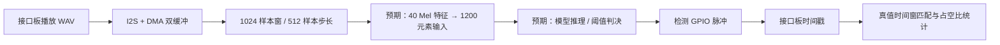

# 流式唤醒词（SWW01）负载设计分析

## 设计目标与定位

该负载模拟持续监听：接口板播放 WAV，设备经 I2S/DMA 接收音频流，并通过检测 GPIO 脉冲报告唤醒事件。它与前三类“先加载固定特征、再执行 `infer`”的路径不同，测试重点包括检出、误报、处理占空比和能耗。仓库给出了采集框架与测试流程，但实时特征提取和模型调用核心只保留接口声明。

图中“预期”节点根据常量与函数声明表示设计接口；对应的连续处理实现未包含在仓库中。

## 核心思路

1. **连续采集与缓冲。** 固件启动时初始化硬件、I2S 缓冲区、计时器和 AI 引擎，UART 主循环处理命令。`start` 将状态设为 `Streaming`、清空模型输入和工作窗，然后启动 DMA；`stop` 停止 DMA 并输出激活记录。设备分配两个 2048 字节 I2S 缓冲区，以便采集与处理交替进行。[固件入口](https://github.com/HeTPort/Test_tinypl/blob/2eefac5b64a957133cb6b997dfa3949a401a68c7/streaming_wakeword/main.c#L64-L100)、[缓冲区](https://github.com/HeTPort/Test_tinypl/blob/2eefac5b64a957133cb6b997dfa3949a401a68c7/streaming_wakeword/sww_ref_util.c#L21-L76)、[启停状态](https://github.com/HeTPort/Test_tinypl/blob/2eefac5b64a957133cb6b997dfa3949a401a68c7/streaming_wakeword/sww_ref_util.c#L329-L412)
2. **滑动声学窗口。** 常量给出 1024 样本窗口、512 样本步长、40 个 Mel 滤波器、1200 个模型输入元素和检测阈值 115。采集代码注释按 16 kHz 解释 512 样本为约 32 ms，1024 样本则约 64 ms。1200÷40=30 个特征帧只是由尺寸推得的候选布局，仓库没有连续特征填充代码可验证。[流式参数](https://github.com/HeTPort/Test_tinypl/blob/2eefac5b64a957133cb6b997dfa3949a401a68c7/streaming_wakeword/sww_ref_util.h#L56-L60)、[采集尺寸说明](https://github.com/HeTPort/Test_tinypl/blob/2eefac5b64a957133cb6b997dfa3949a401a68c7/streaming_wakeword/sww_ref_util.c#L21-L26)
3. **将判定时间交给接口板。** 主机脚本先 `stop/start`，命令接口板记录检测脉冲，然后阻塞播放 WAV；结束后读取检测时间戳、处理脉冲和激活值。真值 JSON 为每个 WAV 给出可接受的检测时间窗。统计时以首个脉冲对齐时间，再计真阳性、漏检和误报，并从处理引脚推算周期、占空比及吞吐量。这使主机评价的是整段实时监听行为。[播放与采集](https://github.com/HeTPort/Test_tinypl/blob/2eefac5b64a957133cb6b997dfa3949a401a68c7/runner/script.py#L297-L357)、[真值格式](https://github.com/HeTPort/Test_tinypl/blob/2eefac5b64a957133cb6b997dfa3949a401a68c7/runner/datasets.py#L46-L95)、[统计实现](https://github.com/HeTPort/Test_tinypl/blob/2eefac5b64a957133cb6b997dfa3949a401a68c7/runner/streaming_ww_utils.py#L132-L167)

## 可见边界与复核点

`th_process_chunk_and_cont_streaming()`、`th_compute_lfbe_f32()` 和 `th_ai_run()` 仅在提交者接口中声明；`feature_extraction.c` 是 FFT 幅值示例，不能视为完整的流式声学前端。因此无法确认 Mel 特征计算、输入环形缓冲、阈值 115 的实际比较方式及连续推理时序。[提交者接口](https://github.com/HeTPort/Test_tinypl/blob/2eefac5b64a957133cb6b997dfa3949a401a68c7/streaming_wakeword/sww_ref_util_submitter.h#L148-L177)、[FFT 示例](https://github.com/HeTPort/Test_tinypl/blob/2eefac5b64a957133cb6b997dfa3949a401a68c7/streaming_wakeword/feature_extraction.c#L57-L103)

评估代码中的真值终点先加一次 `false_pos_suppresion_delay_sec`，匹配条件又加同一延迟；实测允许窗口可能比参数名表达的长两倍。若要将结果用于正式比较，应先校核这段时间窗逻辑和接口板脉冲约定。[时间窗匹配](https://github.com/HeTPort/Test_tinypl/blob/2eefac5b64a957133cb6b997dfa3949a401a68c7/runner/streaming_ww_utils.py#L148-L153)
