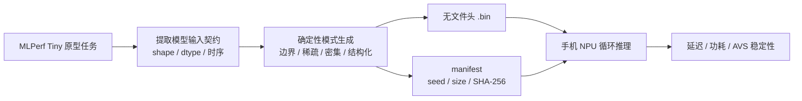

# AVS NPU 确定性输入集

本目录提供面向手机 NPU AVS/DVFS 测试的合成输入。它用于稳定地产生计算负载和检查降压后的输出一致性，不是 MLPerf 准确率数据集，也不附带语义标签。

## 为什么改造成当前形式

原始 MLPerf Tiny 输入围绕模型准确率设计，通常依赖原始图片或 WAV、特征提取脚本、标签文件和评测规则。本项目的当前目标是先把四类模型核心移到手机 NPU 上，测量 AVS/DVFS 条件下的延迟、功耗、稳定性和输出一致性。因此，本输入集保留模型入口的 shape、dtype 和主要时序结构，将输入改成可直接加载的确定性二进制张量。



这样设计有四个原因：

1. **隔离 NPU 核心。** 手机端可以直接把张量送入运行时，先不引入图片解码、音频播放、MFCC/Mel 前端和文件格式解析的差异。
2. **保证可复现。** 固定生成器、seed 和 SHA-256 后，不同 UDP 单板、鸿蒙和安卓框架使用完全相同的输入字节。
3. **覆盖数据相关功耗。** 零值、低动态范围、密集随机、结构化和边界值可观察激活稀疏度、内存翻转和量化边界对功耗及稳定性的影响。
4. **保持资产精简。** 当前 161 个输入共 303,120 字节，适合直接随 benchmark 部署，也避免重新引入完整训练数据。

这些合成张量只适合性能、功耗和稳定性测试。真实数据分布可能改变激活稀疏度、动态量化范围及算子行为，因此正式的代表性功耗测试仍应补充一小组按官方预处理生成的真实输入；准确率、AUC、误报和漏报测试必须使用原始数据、标签及完整预处理链。

## 原型数据集与当前输入的关系

原型来源以 [MLPerf Tiny Inference Rules](https://github.com/mlcommons/tiny/blob/master/benchmark/MLPerfTiny_Rules.adoc) 为准。本目录没有复制这些数据集的样本，只借鉴其任务定义以及本仓库保留下来的模型输入契约。

| 负载 | 借鉴的原型 | 保留的输入契约 | 当前合成输入与原型的差别 |
| --- | --- | --- | --- |
| `ic01` | CIFAR-10 小图像分类，参考模型为 ResNet | `32×32×3`、HWC、`uint8`、10 类任务的图像尺寸 | 不含 CIFAR-10 图片和标签；用梯度、棋盘、条纹、脉冲及随机像素覆盖不同空间结构和数值范围 |
| `kws01` | Google Speech Commands v2，参考模型为 DS-CNN；MLPerf 的 MFCC 路径为 `49×10`、`int8` | `49×10×1` 的时频特征张量 | 不含语音，也不是由真实 WAV 计算出的 MFCC；用低能量、频带、条纹、脉冲和随机矩阵模拟声学特征的形态 |
| `ad01` | DCASE 2020 Task 2 / ToyADMOS 的 ToyCar 机器声音，参考模型为深度自编码器 | 本仓库保留的 `5×128` 特征窗口；当前按小端 `float32` 保存 | 不含 ToyCar 录音、正常/异常标签和真实频谱；用低噪声、频带尖峰、密集随机和边界模式模拟频谱窗口 |
| `sww01` | MLPerf Tiny Streaming Wakeword；官方规则将数据集记为 `Custom`，使用连续 WAV 和检测时间窗，参考模型为 1D DS-CNN | 根据仓库常量保留 40 维特征帧，并将 1200 元素解释为 `30×40` 滑窗 | 不含官方 WAV、唤醒词和时间窗真值；构造 256 帧连续特征流，再从中抽取 32 个窗口，用于持续推理负载 |

参考依据：

- IC01 的 32×32×3 输入和 10 个 CIFAR-10 类别见本仓库的 [`ic_model_settings.h`](../image_classification/ic_model_settings.h)；MLCommons 训练代码也将输入定义为 CIFAR-10 的 32×32×3。
- KWS01 的类别和 49×10×1 输入见 [`kws_model_settings.h`](../keyword_spotting/kws_model_settings.h)；[MLCommons KWS 说明](https://github.com/mlcommons/tiny/blob/master/benchmark/training/keyword_spotting/README.md)记录了 Speech Commands v2、MFCC 49×10 和 INT8 二进制输入。
- AD01 的 5×128 特征设置见 [`micro_model_settings.h`](../anomaly_detection/micro_model_settings.h)；[MLCommons AD 说明](https://github.com/mlcommons/tiny/blob/master/benchmark/training/anomaly_detection/README.md)说明其源自 DCASE 2020 Task 2，并只采用 ToyCar 类型。
- SWW01 的 1024 样本窗、512 样本步长、40 个 Mel 特征和 1200 元素输入见 [`sww_ref_util.h`](../streaming_wakeword/sww_ref_util.h)。`30×40` 是根据 `1200÷40` 得到的当前输入布局假设，恢复模型后必须用实际 tensor metadata 再确认。

### 各类输入的设计

#### IC01：空间结构与像素翻转

Smoke 集用全零、全最小、全最大、横向渐变、棋盘、单点脉冲、低动态随机和全范围随机快速检查模型是否能加载和执行。Stress 集使用低动态随机、全范围随机、条纹和边界交替四组模式，每组 8 个变体。其目的不是模拟自然图像，而是用稳定、可控的像素活动度比较 NPU 在不同激活密度下的功耗与错误率。

#### KWS01：时频矩阵形态

KWS 输入已处在 MFCC 特征层，因此直接生成 49×10 的 INT8 矩阵。沿时间轴和特征轴布置渐变、条纹、稀疏脉冲及随机值，可覆盖静音附近、局部能量出现和高动态活动等计算输入。它保持 DS-CNN 的输入尺寸，但没有 Speech Commands 单词语义，不能产生有效的关键词准确率。

#### AD01：频谱窗口与异常尖峰

AD 输入按 5 个连续切片、每片 128 个频率特征生成。低随机模式用于稳定背景，`band_spike` 在局部频带放入强值，密集随机用于高活动窗口，边界模式用于检查浮点和后续量化路径。该设计借鉴 ToyCar 异常声音的频谱窗口形式，没有复刻机器声音的统计分布。

#### SWW01：连续流和滑窗复用

SWW 先生成 256×40 的连续特征流，依次包含 64 帧低活动、64 帧频带结构、64 帧周期脉冲和 64 帧密集随机；随后均匀抽取 32 个 30×40 窗口。这样可以在手机端实现环形缓冲、固定步长调度和连续 NPU 唤醒。当前形式从模型特征入口开始，不能覆盖麦克风、I2S、FFT/Mel 前端和基于时间窗的误报、漏报评测。

## 为什么是 8 个 Smoke 和 32 个 Stress

- 8 个 Smoke 对应 8 种基础模式，适合启动后在几秒内完成输入加载、shape、dtype、输出稳定性和错误处理检查。
- 32 个 Stress 由 4 组负载模式各 8 个确定性变体组成，能够轮换输入，降低单一样本重复导致缓存或数据相关优化偏差的风险。
- SWW 额外保留一条 256 帧流，使窗口之间具有连续上下文，并可测试周期唤醒和持续运行两种调度方式。
- 这个数量是手机 NPU AVS 工程集的起点，不是统计学准确率样本量。若后续进行代表性功耗或模型质量评测，应另建真实输入 profile，不应覆盖本合成集。

## 输入规模

| 负载 | Smoke | Stress | 数据格式 |
| --- | ---: | ---: | --- |
| `ic01` | 8 个 | 32 个 | `32×32×3`，HWC，`uint8` |
| `kws01` | 8 个 | 32 个 | `49×10×1`，`int8` |
| `ad01` | 8 个 | 32 个 | `5×128`，小端 `float32` |
| `sww01` | 8 个窗口 | 32 个窗口 + 256 帧特征流 | 窗口 `30×40`、帧 `40`，`int8` |

每类输入都覆盖以下模式：

- 低激活或低动态范围；
- 密集伪随机；
- 梯度、条纹、棋盘或频带等结构化数据；
- 最小值、最大值、脉冲和交替边界值。

## 目录

```text
input/
├── generate_inputs.py
├── manifest.json
├── ic01/
│   ├── manifest.json
│   ├── smoke/
│   └── stress/
├── kws01/
├── ad01/
└── sww01/
    ├── smoke/
    └── stress/
        ├── windows/
        └── stream_features_256x40_int8.bin
```

二进制文件不包含文件头。shape、dtype、生成模式、seed、字节数和 SHA-256 均记录在相应的 `manifest.json` 中。

## 重新生成

仅依赖 Python 3 标准库：

```bash
python input/generate_inputs.py
python input/generate_inputs.py --verify
```

生成器使用代码内实现的 PCG32，避免依赖 Python、C++ 标准库各自的随机分布实现。相同生成器版本、seed 和参数应产生完全相同的文件。

## 在 benchmark 中使用

1. 程序初始化阶段读取或生成整个输入库。
2. 在 warmup 和正式测试期间按 `batch_index % sample_count` 轮换输入。
3. 输入准备应位于 inference-only 计时区间之外。
4. 正常电压下为每个输入建立模型输出 Golden。
5. AVS 测试中持续比较输出；INT8 可逐元素或 CRC 校验，FP16 应使用数值容差。

`ad01` 当前使用 `float32`，与仓库中 5×128 特征设置一致。若最终模型输入为量化 INT8，应在模型确定后新增独立 profile，不要在不记录版本的情况下直接覆盖本输入集。

`sww01` 的 256 帧特征流由四个连续 64 帧区段组成：低激活、频带结构、周期脉冲和密集随机。32 个 stress 窗口从该特征流中均匀抽取，每个窗口包含 30 帧。
